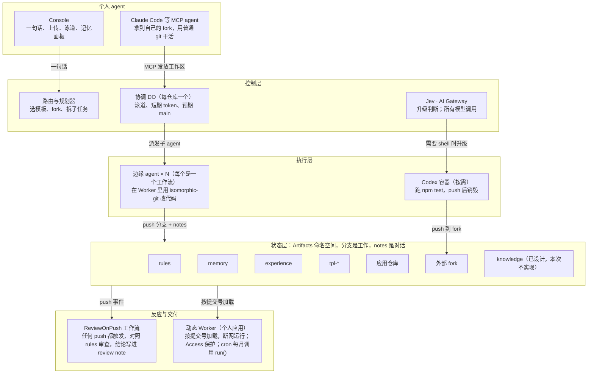

# Artifacts-OS 工程修改设计方案

> 本文件是 2026-10-03 三轮评审定稿的设计方案；代码按它实现于 `artifacts-os/v1` 分支。实现时有以下几处按平台事实做了修正，正文已同步：
>
> - **工作 fork 命名**：Artifacts 仓库名只允许字母、数字、`.`、`-`、`_`，所以是 `<应用>.ws-<agent>-<id>`，不是 `~`。
> - **预览地址**：分支名中的 `/` 在 URL 里写成 `~`，例如 `/apps/card-watch/@attempt~fuzzy/`。
> - **fork 默认只复制默认分支**（binding 的 `defaultBranchOnly` 默认为 true），所以 notes 是否随 fork 复制由 D1 第 5 项实测。
> - **审查兜底**：若 push 事件不可用（D1 第 3 项失败），设 `REVIEW_MODE=direct`，agent push 后自行触发审查。
> - **playbook 合并**：容器写到 `experience` 的 `playbook/*` 分支在审查通过后由运行时自动合并。
> - **应用页面隔离**：应用页面也是 agent 写的，所以一律以 CSP sandbox（不透明 origin）返回，不带主人的 cookie/Access 头，不能调用 API；审批栏是运行时自己的页面，应用以 iframe 嵌入。页面仍可导航到外站，README 已注明。
> - **合并只认审过的那个提交**：审批栏提交 sha，审查结论绑定 sha，分支移动后需重新审查。
> - **容器写 playbook**：容器拿到的是 `experience` 的 fork，push 后由运行时导入、审查，只改 `playbooks/*.json` 才自动合并。
> - **trace notes** 与 **knowledge 仓库**、**邮件导入**：设计已定，本次未实现，README 的 Built / Designed 表已注明。

2026-10-03 · Samuel（Drlon Software）

## 概要

把 codex-cloud 改造成一个**单 Worker 的 Artifacts-OS 运行时**：

- 个人应用以动态 Worker 运行，按提交号直接从 Artifacts 加载。
- 子 agent 是工作流实例，在 Worker 里用 isomorphic-git 读写仓库。
- 外部 agent 拿自己的 fork 工作。
- 只有 Jev 判断需要 shell 时，才启动原有的 Codex 容器。

本方案的依据、目标和原则：

- **依据**：视频剧本 v0.3、《终审评分预测与作战清单》、三轮评委审查（10/3），以及对 Cloudflare 官方文档和比赛规则的事实核查。
- **目标**：视频里每个正在运行的画面，都由本方案的代码真实产生。10/12 功能冻结，10/14 23:59 PDT 前提交。
- **原则**：Git 是唯一的交接协议。没做成的功能不演，统一列入 Built / Designed 对照表。
- **第一件事**：跑 D1 验证第 1–5 项（见"D1 验证清单"），它们决定整个架构是否成立。

## 已定稿决策

三轮评委审查共定稿 19 项。另有 2 项事实待确认，已在 10/4 确认（见"风险与待确认事项"）。

| 轮次 | 决策点 | 定稿 |
| --- | --- | --- |
| R1 | 代码基线 | 在 codex-cloud 上原地演进；新代码用 TypeScript；容器宿主的 JS 冻结；README 区分"10/1 前的基础"和"比赛期间新做的" |
| R1 | 个人应用承载 | 动态 Worker：按 `仓库@提交号` 从 Artifacts 读代码加载；任何分支 push 后即可预览；断网运行 |
| R1 | 子 agent 执行单元 | 每个子 agent 是一个工作流实例；每个应用仓库配一个协调 Durable Object |
| R1 | 合并与冲突 | 在 Worker 内用 isomorphic-git 做三方合并，冲突时写冲突标记；由 Jev 判断在边缘解决还是升级到容器 |
| R1 | push 事件 | 以命名空间级的工作流事件触发器为主；执行 push 的一方直接通知协调对象作为兜底 |
| R1 | 段 2 三条策略 | 来自 experience-repo 的"商户名归一"playbook，规划器读取后分配 |
| R1 | 边缘 agent 主模型 | 按"改代码最稳"选：结构化输出 JSON 补丁、低温度；D1 用同一份账单小测后再定 |
| R1 | 规模证明 | 维持现状，只报小而实的数字，不做压测层 |
| R1 | Console 技术栈 | Preact + htm，按 ES 模块加载，不打包 |
| R2 | 应用运行约定 | 不打包、无 npm 依赖；用 `app.json` 声明；应用断网，只能通过运行时传入的"仓库能力"读写 |
| R2 | 落选分支 | 移到 `archive/` 保留，并写"落选"结果 note |
| R2 | 审批栏版本切换 | 同页切换，不做并排 |
| R2 | main 保护 | 内部边缘 agent 在同一仓库开分支；外部 agent（Claude Code、容器）用自己的 fork；main 守卫兜底 |
| R2 | bank-watch 升级理由 | 仓库声明"合并前必须 `npm test`"，而运行时不在 Worker 里执行任意 shell，所以升级；PDF 上传时用 `toMarkdown` 转文本；模拟数据设计成"模板修复会让一个测试失败" |
| R2 | 记忆写入 | 直接写入 main，不走审批；Console 记忆面板可一键撤销（git revert） |
| R3 | 预览地址 | 只用路径形式 `/apps/<仓库>/@<分支>/`（分支名里的 `/` 写成 `~`），由 Access 保护 |
| R3 | 部署形态 | 合并成一个 Worker；README 放一键部署按钮和 `npm run setup`；按钮跑不通就退回 setup 命令 |
| R3 | MCP | 只做 `request_app`、`open_workspace`、`status` 三个工具，实际工作走普通 git；鉴权用 Access 服务令牌 |
| R3 | D1 清单 | 共 12 项：1–5 必须最先出结果，6–9 当天尽量完成，10–12 随后 |

## 现状盘点

仓库目前仍是 codex-cloud：约 1,660 行纯 JS、两个 Worker、3 个提交，**完全没有调用 Artifacts，也从不 push**。剧本需要的能力约九成要新写。

| 现有部分 | 文件 | 处理 |
| --- | --- | --- |
| 容器宿主：Durable Object 驱动 Codex app-server，含 FIFO 通信、帧日志、心跳 | `units/host/src/index.js`、`boot.js` | 保留，只做两处改动（见"容器单元与 Console"） |
| 计量与准入：容器秒数、并发、每日轮次 | `units/host/src/user-index.js` | 保留并扩展：加应用注册表、定时表、agent 运行计数 |
| Access JWT 校验 | `units/edge/src/access.js` | 改用 `ctx.access.getIdentity()`，原文件作兜底 |
| AI Gateway 出站 | `units/host/src/index.js` | 抽成公共模块，供边缘 agent 共用 |
| 单页界面（任务列表、帧渲染） | `units/edge/src/ui.js` | 由 Console 替换，帧渲染逻辑借用到容器泳道 |
| 两个 wrangler 配置 | `units/*/wrangler.jsonc` | 合并为根目录下的一个 `wrangler.jsonc` |

**要一并处理的已知缺陷**：

- `scene.pushed` 从未被赋值。
- 界面链接到的 GitHub 分支从未存在。
- README 提到的 `Dockerfile`、`docs/adr/` 不在仓库里。
- `.gitignore` 忽略了 `docs/*`，所以设计文档要放到别处，或者改规则。

## 目标架构

整个运行时是一个 Worker。状态全部在 Artifacts；Worker 只负责路由、协调和决策；容器只在 Jev 判断需要 shell 时才存在。



读法：从上往下是一次需求的完整路径。

- 所有执行者（边缘 agent、容器、外部 agent）唯一的输出，是 push 到状态层。
- push 事件触发审查。
- 任何分支都能被动态 Worker 立即加载成预览。

具体绑定见"部署与 README"。

## 目录结构

修改后，仓库根目录就是一个 Worker。`seeds/` 和 `templates/` 的内容在首次运行时由运行时自己写进 Artifacts，不需要单独的建仓脚本。

```
artifacts-os/
├─ wrangler.jsonc            # 唯一的 Worker 配置：全部绑定、cron、事件触发器
├─ package.json              # name: artifacts-os；deploy / setup / mirror 脚本
├─ LICENSE  README.md  AGENTS.md
├─ src/
│  ├─ index.ts               # fetch 路由：/  /api/*  /apps/*  /mcp；scheduled；导出全部类
│  ├─ control/
│  │  ├─ router.ts           # 一句话 → 选模板（Jev choice）→ fork
│  │  ├─ planner.ts          # 读模板 AGENTS.md、app.json、记忆、playbook → 拆子任务
│  │  ├─ coordinator.ts      # RepoCoordinator DO：泳道、token、预期 main、WebSocket
│  │  ├─ registry.ts         # UserIndex 扩展：应用注册表、定时表、计量
│  │  └─ jev.ts              # typesafe/jev 调用与 decision note
│  ├─ agents/
│  │  ├─ agent-run.ts        # AgentRun 工作流：一个子 agent 的全部步骤
│  │  ├─ review-on-push.ts   # ReviewOnPush 工作流：push 事件 → 规则审查
│  │  ├─ new-app.ts          # NewApp 工作流：生成应用主线
│  │  ├─ fan-out.ts          # FanOut 工作流：模板升级扇出
│  │  └─ llm.ts              # AI Gateway 主模型 + Workers AI 降级，JSON 补丁输出
│  ├─ git/
│  │  ├─ memfs.ts            # isomorphic-git 内存文件系统
│  │  ├─ ops.ts              # 浅克隆、提交、push、合并、archive
│  │  └─ notes.ts            # 按"类型/写入方"读写 notes ref
│  ├─ apps/
│  │  ├─ host.ts             # 动态 Worker 加载、审批栏注入、预览只读模式
│  │  ├─ capability.ts       # 传给应用的"仓库能力" RPC 接口
│  │  └─ approval-bar.ts     # 审批栏 HTML 与合并 API
│  ├─ rules/check.ts         # 读 rules-repo 的规则并做静态检查
│  ├─ mcp/server.ts          # MCP 三个工具
│  └─ container/             # 原 units/host 原样移入，只改两处
│     ├─ task-host.js  boot.js
├─ console/                  # Preact + htm 静态资源
├─ templates/tpl-scheduled-scan/   # 模板源，首次运行时写入 Artifacts
├─ seeds/{rules,memory,experience}/ # 三个认知仓库的初始内容
├─ fixtures/statements/      # 模拟账单（视频负责人 10/6 前交付）
└─ scripts/{setup,mirror}.mjs # 配置引导；把 card-watch 连同 notes 镜像到 GitHub
```

## 仓库拓扑与权限

全部仓库都在同一个 Artifacts 命名空间里。token 按仓库签发，没有分支级权限，所以"谁能写哪里"靠三层实现：token 范围、fork 边界、main 守卫。

| 仓库 | 内容 | 内部边缘 agent | 外部 agent（Claude Code、容器） | 运行时 | 你 |
| --- | --- | --- | --- | --- | --- |
| `rules` | `rules.json`：数据不得外发、卡号只留后四位、可改路径、模型预算 | 只读 | 只读 | 只读 | 用 git 直接修改 |
| `memory` | 卡号后四位、发卡行、商户别名、偏好 | 只读 | 只读 | 写 main | Console 撤销 |
| `experience` | playbook、prompt 策略 | 只读；新 playbook 写分支 | 只读；容器写分支 | 审查通过后合并 | Console 撤销 |
| `tpl-scheduled-scan` | 模板，按版本打 tag | 修复写 `fix/*` 分支 | 只读 | 审批后合并、打 tag | 审批栏合并 |
| `card-watch` 等应用仓库 | 应用代码、账单、快照 | 写本仓库 `agent/*` `attempt/*` `upgrade/*` 分支 | 只读 | 写 main、archive | 审批栏合并 |
| `<应用>.ws-<agent>-<id>` | 外部 agent 的工作 fork | — | 写（1 小时） | 拉取分支与 notes | — |

**token 规则**：

- 一律短期：边缘 agent 15 分钟，外部 agent 1 小时。
- 由协调对象签发并记账。
- 任务结束即调用 `revokeToken` 吊销。

**main 守卫**：协调对象记录"main 应该指向的提交"。审查工作流一旦发现 main 被移到别处，就自动改回，并写一条 `refs/notes/outcome/guard` 记录。

## 应用运行约定

一个应用就是一个仓库里的一组 ES 模块，加一份 `app.json`。运行时按提交号把它加载成断网的动态 Worker。应用的全部读写，都要经过运行时传入的 `REPO` 接口。

**`app.json` 示例**（card-watch）：

```json
{
  "name": "card-watch",
  "template": { "repo": "tpl-scheduled-scan", "version": "v1.0" },
  "schedule": "0 9 1 * *",
  "main": "src/main.js",
  "templatePaths": ["src/runtime/**", "src/csv.js", "src/pipeline.js", "src/report-shell.js", "tests/harness.js"],
  "agentPaths": ["src/adapters/**", "src/normalize.js", "src/detect.js", "src/report.js", "tests/*.test.js", "config.json"],
  "gates": { "beforeMerge": [] }
}
```

bank-watch 的 `gates.beforeMerge` 为 `["npm test"]`，这是 Jev 判断要升级到容器的依据之一。

**模块约定**：

- `src/main.js` 默认导出一个 `WorkerEntrypoint` 风格的对象，提供两个方法：
  - `fetch(request)`：报告页、上传页。
  - `run({ now, mode })`：流水线，依次为导入、解析、分析、报告。
- 动态 Worker 的文档没说能触发 `scheduled`，所以每月运行由运行时的 cron 调用 `run()`。
- 统一的交易数据结构定义在模板的 `src/types.js`，所有适配器都输出这个结构。这就是段 0 两个子 agent 能并行工作的边界。
- 页面里的链接一律用相对路径，因为预览地址带 `/@<分支>/` 前缀。

**`REPO` 能力接口**：运行时用 `ctx.exports` 生成 RPC 存根，传入 `env`。

| 方法 | 作用 | 预览模式下 |
| --- | --- | --- |
| `readFile(path)` / `list(dir)` | 读当前加载的提交 | 可用 |
| `memory(key)` | 只读访问 memory 仓库的某个文件，如 `merchant-aliases.json` | 可用 |
| `writeSnapshot(name, json)` | 写 `snapshots/`，由运行时提交 | 只保留在内存，不提交 |
| `log(event)` | 往 Console 泳道发事件 | 可用 |

**加载参数**：

- 调用 `LOADER.get("<仓库>@<提交号>", …)`。
- `globalOutbound: null`，即断网。
- `limits: { cpuMs }`，防止死循环。
- 模块文件通过 Artifacts 的 `readTree` / `readBlob` 读取，并按提交号缓存在协调对象里。

**模板的 `AGENTS.md`** 写清三件事：

1. 不能引入 npm 依赖。
2. 只能改 `agentPaths` 里的路径。
3. 数据结构和相对路径的约定。

## git-notes 约定

沿用剧本 v0.3 的设计：

- commit 只写一行标题和一句说明。
- agent 之间的一切信息写成 notes。
- 每个 notes ref 只有一个写入方，按"类型/写入方"两级命名，所以并发 push notes 时不会互相拒绝。

| notes ref | 写入方 | 内容 | 实现期 |
| --- | --- | --- | --- |
| `refs/notes/intent/<agent-id>` | 每个子 agent；外部 agent 分别用 `claude-code`、`codex-container` | 认领、意图、里程碑状态；`to` 字段默认为 `all` | 10/5 |
| `refs/notes/telemetry/<agent-id>` | 每个子 agent | 模型、token、耗时 | 10/5 |
| `refs/notes/review/<auditor-id>` | 审查工作流 | 对照 rules 的结论与命中的规则 | 10/7 |
| `refs/notes/decision/jev` | Jev | 在边缘解决还是升级、概率；定向给容器时 `to` 写容器 id | 10/10 |
| `refs/notes/decision/owner` | 运行时代你写入 | 审批栏的选择与理由 | 10/8 |
| `refs/notes/outcome/<source>` | owner、rules、tests、guard | 合并或落选、是否被拦、测试结果 | 10/8，可砍 |
| `refs/notes/trace/<agent-id>` | 每个 agent | 提示词、工具调用、输出；超出预算时截断为摘要加哈希 | 10/9，可砍 |

**实现要点**：

- isomorphic-git 的 `addNote` / `readNote` / `listNotes` 都支持自定义 ref。push 时，把分支和自己的 notes ref 放在同一次推送里。
- 外部 agent 的 notes 写在它自己的 fork 里。运行时合并分支时，一并把 `refs/notes/*` 拉取到原仓库。
- 审查工作流写 notes 也会产生 push。如果 notes 的 push 会触发事件（D1 第 3 项），工作流就按 ref 过滤掉 `refs/notes/*`，避免循环触发。
- 评委验证命令（README 与段 5 相同）：先 `git fetch origin 'refs/notes/*:refs/notes/*'`，再 `git log --notes='refs/notes/*'`。

## 核心流程

八条流程（A–H）对应剧本各段。每条都只用一种交接方式：把分支和 notes push 到 Artifacts。

### A. 一句话生成应用（段 0）

1. Console 调用 `POST /api/needs`，启动 NewApp 工作流，计时开始。
2. 路由：Jev 用 `choice` 在模板清单里选出 `tpl-scheduled-scan`，概率显示在泳道里。
3. fork 模板为 `card-watch`，轮询 `info()` 直到就绪，并记录 fork 耗时。
4. 规划器读取模板的 `AGENTS.md`、`app.json` 和 memory（卡号后四位、发卡行），按交易数据结构拆成两个子任务。
5. 启动两个 AgentRun：
   - `agent/input`：格式适配 + 商户名归一。
   - `agent/analysis`：订阅识别 + 涨价识别 + 报告。
6. 两个分支都通过规则审查后，自动合并进 main。首次生成不走审批栏，审批栏只用于"变更"。
7. 应用注册到应用表，地址 `/apps/card-watch/` 可用。上传 8–10 月账单，点"立即运行"，报告出现，计时停止，得到 T1。

### B. 一个子 agent 的步骤（AgentRun 工作流）

1. 向协调对象申请 token：本仓库可写 15 分钟；rules、memory、experience 只读。
2. 浅克隆到内存，并拉取 `refs/notes/intent/*`。
3. 读已有的意图 note，认领一个未被占用的方向，写 `intent`（claimed），并先推送 notes。
4. 调用主模型，输出 JSON 文件补丁。补丁只允许涉及 `agentPaths` 里的路径。
5. 冒烟检查：用动态 Worker 以预览模式加载该提交，跑一次 `run()`；抛错就重试一次。
6. 提交（一行标题），写 `telemetry` 和 `intent`（pushed），把分支和 notes 一起 push。
7. 向协调对象报告：更新泳道状态，计量加 1。

### C. 三分支竞争与两层审查（段 2，承重墙）

1. 你在 Console 里说出 Streamly 的问题；规划器从 experience 读取"商户名归一"playbook，得到三条策略。
2. 三个 AgentRun 错开约 2 秒启动，分支分别是 `attempt/rules`、`attempt/fuzzy`、`attempt/enrich`。后启动的会读到先启动的意图 note。
3. 每次 push 触发 ReviewOnPush。它按 `rules.json` 做三项静态检查，并写 `review` note：
   - 有没有出站网络调用；
   - 是否只改了允许的路径；
   - 卡号脱敏的测试用例是否满足。

   `attempt/enrich` 因为调用外部服务被拒；即使漏检，断网沙箱也会让它运行失败。
4. 剩下两个分支各自可预览，等你在审批栏里审。

### D. 审批栏与合并（段 2、段 3）

1. 访问 `/apps/card-watch/@attempt~fuzzy/` 时，运行时在页面顶部注入审批栏。审批栏包含：
   - 改了什么：文件列表 + 意图 note 摘要；
   - 规则怎么说：review note；
   - 为什么：intent / decision；
   - 同页切换版本；
   - Merge 按钮。
2. 预览以只读模式运行，用同一份账单现场出报告，不写快照。
3. 点 Merge 后：
   - 运行时用写 token 做合并并 push main，同时更新协调对象里的"预期 main"；
   - 写 `decision/owner`；
   - 其余分支移到 `archive/`，并写 `outcome` 落选 note。
4. 线上地址指向新的提交号，动态 Worker 自动加载新代码。

### E. 记忆写入与撤销（段 2）

1. 合并后，运行时让模型从这次改动里提取商户别名，直接提交到 memory 仓库的 `merchant-aliases.json`。
2. Console 的记忆面板列出最近的记忆提交，每条都有"撤销"按钮，点击会生成一个 revert 提交。
3. 录制前几天真实使用时撤销一次，历史里就自然出现 revert。

### F. 模板修复扇出与容器升级（段 3）

1. 11 月账单里的 `"ACME, INC."` 让模板的 CSV 读取器出错。agent 在 card-watch 里修好后，发现改动落在 `templatePaths` 里，于是写 note 标明"这是模板代码"，并把修复以 `fix/csv-quoted-comma` 分支推到模板仓库。
2. 你在模板的审批栏点合并，运行时打 tag `v1.1`，启动 FanOut 工作流。
3. FanOut 在协调对象内为每个同族仓库启动一个合并 agent，各自拉取模板 `v1.1`，执行 `merge(abortOnConflict: false)`：
   - `card2-watch`：干净合并，生成 `upgrade/tpl-v1.1` 分支，预览等你确认（绿）。
   - `phone-watch`：分号定制和修复改到了同一函数，产生冲突。Jev 用 `choice` 判为可在边缘解决，边缘 agent 用模型修好冲突标记后 push（琥珀）。
   - `bank-watch`：`gates.beforeMerge` 要求 `npm test`。Jev 判为需要 shell，写 `decision/jev`（`to` 为容器）（红）。
4. 容器升级的步骤：
   1. fork 出 `bank-watch.ws-codex-container-<id>`，签发 1 小时写 token。
   2. 启动容器。Codex 读 Jev 的 note，检出指定提交，跑 `npm test` 看到失败，修复后再跑通，push 到 fork。
   3. Codex 顺带把解法写成 playbook，push 到 experience 的一个分支。
   4. 容器销毁，计量记下容器分钟数。
5. 运行时从 fork 拉取分支和 notes，生成 bank-watch 的预览，等你确认。

### G. 外部 agent 通过 MCP 接入（段 4）

1. Claude Code 调用 `open_workspace("card-watch", "add Northwind Bank format")`，拿到 fork 地址、写 token、只读 token 和 AGENTS.md。
2. Claude Code 用普通 git 完成 clone、修改、提交，写 `refs/notes/intent/claude-code`，然后 push 到自己的 fork。
3. 命名空间级的 push 事件触发 ReviewOnPush。运行时识别出这是 fork，把分支拉进原仓库，命名为 `ext/claude-code/<分支>`。Console 出现新泳道，预览带同样的审批栏。

### H. 账单上传与每月运行（段 0、段 6）

1. 在 Console 上传账单：CSV 直接提交到 `data/statements/`；PDF 先用 `toMarkdown` 转成文本，原件和文本一起提交。
2. 运行时的 cron 每小时检查一次应用表，对到期的应用调用其 main 提交的 `run()`，结果快照由运行时提交到 `snapshots/`。
3. Console 显示下次运行时间；"立即运行"走同一条路径。

## 容器单元与 Console

### 容器单元：只改两处

容器宿主（TaskHost）的心跳、FIFO 通信、帧日志、计量全部原样保留。移入单 Worker，只是换了一个入口文件来导入它。

1. **从 Artifacts 的指定提交接手**：
   - `boot.js` 的克隆源改为环境变量 `ARTIFACTS_GIT_REMOTE`（`https://x:<token>@<remote>`），克隆后执行 `git checkout <sha>`。
   - 启动时额外执行 `apk add nodejs npm`，用于跑 `npm test`。
2. **push 回 Artifacts**：
   - 在停止流程里的"本地提交"之后，加一步 `git push`，把分支和 `refs/notes/*` 推到 fork。
   - push 成功后给 `scene.pushed` 赋值，并通知协调对象。

另外两点小改动：

- 提交作者改为 `codex-container`。
- Codex 的目标文本由运行时生成，固定包含四步：读 `decision/jev` note、跑测试、修复、写 playbook。

### Console：Preact + htm，不打包

| 视图 | 内容 | 对应剧本 |
| --- | --- | --- |
| 输入与应用列表 | 一句话输入框；每个应用一张卡片，显示模板版本、下次运行时间、线上地址 | 段 0、段 6 |
| 泳道 | 每个 agent 一条泳道，状态依次为 claimed → started → pushed → blocked → done；Jev 卡片显示选择和概率；容器泳道带容器分钟计数；右上角是真实计时器 | 段 0、2、3、4 |
| 计量条 | agent 运行次数、容器数、容器分钟 | 段 3、段 6 |
| 上传与运行 | 上传账单、立即运行、报告链接 | 段 0、段 3 |
| 记忆面板 | 最近的记忆提交、diff、撤销按钮 | 段 2 |
| 事件日志导出 | `/api/events.ndjson`，带时间戳，供后期对齐架构小地图 | 段 0–5 |

审批栏不在 Console 里，而是注入在应用页面的顶部。这是"在应用里审查变更"的核心画面。实时数据来自协调对象的 WebSocket，不进 Git。

## 部署与 README

目标是一个 Worker、一个按钮、一条 setup 命令。按钮能否覆盖全部绑定，在 D1 第 10 项实测；跑不通就只写 setup 命令，README 照实写。

**`wrangler.jsonc` 需要的绑定**：

- `artifacts`：`ARTIFACTS`，命名空间为 `artifacts-os`（首次建仓时自动创建）
- `worker_loaders`：`LOADER`
- `ai`：`AI`（用于 Jev、`toMarkdown`、降级模型）
- `durable_objects`：`RepoCoordinator`、`UserIndex`、`TaskHost`（容器类）
- `workflows`：`AgentRun`、`ReviewOnPush`、`NewApp`、`FanOut`
- `containers`：`TaskHost`，镜像为 alpine 3.20，不需要构建 Dockerfile
- `triggers.crons`：每小时一次
- `triggers.events`：`cf.artifacts.repo.pushed`，只按命名空间过滤，目标为 `ReviewOnPush`
- `assets`：`console/`
- secrets：AI Gateway token、主模型 key、`OPENAI_API_KEY`（给容器里的 Codex 用）

**`npm run setup` 做的事**：

1. 检查 Wrangler 版本（≥ 4.145）。
2. 提示填写 secrets。
3. 部署。
4. 打开 Worker 设置页，提示一键启用 Access。
5. 生成 MCP 用的 Access 服务令牌，并打印 Claude Code 的配置片段。

种子仓库由运行时在首次请求时自建，不在 setup 里做。

**README 必含**：

- 一键部署按钮与 setup 命令；Console 主路径；MCP 可选路径。
- Built / Designed 两栏表，与段 5 字卡一致。
- notes 验证命令；公开镜像地址。
- 一行说明：哪些代码是 10/1 前的 codex-cloud 基础，哪些是比赛期间新做的。
- MIT 许可证与作者（Doris Gan 及队友）。

**公开镜像**：`npm run mirror card-watch` 用真 git 从 Artifacts（只读 token）拉取，连同 `refs/notes/*` 一起推到 GitHub 的 `artifacts-os-demo-card-watch`。

**域名**：

- 录制和公开演示用自定义域名 `artifacts-os.nevoflux.app`。
- 地址仍是路径形式，例如 `artifacts-os.nevoflux.app/apps/card-watch/`、`…/apps/card-watch/@attempt~fuzzy/`。
- Access 在该域名上建一个自托管应用，覆盖 `/apps/*`、`/api/*`、`/mcp` 和 Console。
- 评委自己部署时没有域名，就照旧用 workers.dev 加一键 Access。两条路径的代码完全相同。

## D1 验证清单

共 12 项，按"失败会推翻方案"的程度排序。1–5 必须最先出结果，6–9 当天尽量完成，10–12 随后。任何一项失败，当天就切换到替代方案，并同步修改旁白。

- [ ] **1** 在 Worker 里用 isomorphic-git 浅克隆、提交、push 模板大小的仓库，内存够用；顺带记录 fork 到就绪的耗时（测 10 次）。失败 → 把边缘补丁改到容器里做（重大降级）。
- [ ] **2** 动态 Worker 能按提交号从 Artifacts 读代码并加载；`globalOutbound: null` 断网生效；能通过 RPC 传入 `REPO` 能力；能调用 `run()`。失败 → 退回 Workers for Platforms + 部署工作流。
- [ ] **3** 命名空间级的 `cf.artifacts.repo.pushed` 工作流触发器：新 fork 出来的仓库 push 也能触发；notes 的 push 是否触发。失败 → 由执行 push 的一方直接通知协调对象。
- [ ] **4** isomorphic-git 的 `merge(abortOnConflict: false)` 在 Worker 里能写出冲突标记，补完后能以两个父提交提交。失败 → 有冲突一律升级到容器。
- [ ] **5** notes：自定义 ref 能读写并 push；fork 是否带上 notes；能否从 fork 拉取 `refs/notes/*`。失败 → 改用 commit trailer，旁白用降级句。
- [ ] **6** "可写 fork + 只读原仓库"的 token 组合可用。失败 → 退回同仓库分支 + main 守卫。
- [ ] **7** `typesafe/jev` 的 `choice` 返回概率。失败 → 改用 Workers AI 小模型 + JSON schema。
- [ ] **8** 容器用 fork 的写 token push，容器销毁后分支还在。失败 → 结果先存在协调对象里，再由 Worker push。
- [ ] **9** 一键 Access 能保护 workers.dev 上的 `/apps/*`，未登录被拒；自定义域名 artifacts-os.nevoflux.app 上的 Access 应用同样生效。失败 → 改用短期签名链接。
- [ ] **10** 视频负责人用全新账号走一遍一键部署按钮。失败 → 只保留 setup 命令。
- [ ] **11** `toMarkdown` 转换模拟 PDF 账单，能得到可解析的表格文本。失败 → bank-watch 改用 CSV。
- [ ] **12** 主模型小测：同一份账单、同一条需求跑 3 次，结果一致。失败 → 换模型或调低温度。

已从旧清单删除两项：

- Workers for Platforms 开通（改用动态 Worker）。
- commit trailer 读取（改为第 5 项的兜底）。

## 排期

工程在 10/12 功能冻结，按承重程度排序：主线 10/6、段 2 全部能力 10/9、扇出与容器 10/11、MCP 与镜像 10/12。

| 日期 | 工程（1 人） | 视频（1 人） | 可录 |
| --- | --- | --- | --- |
| 10/3 | D1 第 1–5 项；单 Worker 骨架、合并两个 wrangler 配置 | 旁白按本方案改句；开始设计模拟数据 | — |
| 10/4 | D1 第 6–12 项；模板 `tpl-scheduled-scan` 与 `app.json` 约定；种子仓库 | 段 1 三幕动画；架构图初稿（按本方案组件） | 段 1 |
| 10/5 | AgentRun 工作流、协调对象、两个子 agent 分工；动态 Worker 承载 `/apps/` | 模拟账单交付第一版 | — |
| 10/6 | 上传与立即运行；最简 Console（泳道）；主线端到端，实测 T1 | 按 T1 三档定冷开场旁白；全部模拟数据（含冲突与测试失败设计）交付；README 骨架 | 段 0 |
| 10/7 | ReviewOnPush、规则检查、review note；playbook 驱动的三分支竞争 | 段 0 素材；段 5 架构动画 | — |
| 10/8 | 审批栏注入、同页切换、合并、archive、decision 与 outcome note | 段 2 前半素材 | — |
| 10/9 | 记忆写回与撤销；`git log --notes` 演示；段 2 锁定 | 新账号从零部署验收；段 2 全段 | 段 2 |
| 10/10 | 三个同族仓库；模板修复上推；FanOut 与合并；Jev 分诊 | 段 3 模板修复 diff | — |
| 10/11 | 容器升级（fork token、`npm test`、push、playbook）；计量 | 段 3 全段 | 段 3 |
| 10/12 | MCP 三个工具；公开镜像；闲置成本计算；README 终版；**功能冻结** | 段 4、段 6；按 Built / Designed 逐行核对 | 段 4、6 |
| 10/13 | 只修 bug | 录旁白、剪辑；段 5 clone 镜头 | 段 5 |
| 10/14 | 待命 | 最终核对与提交（23:59 PDT 前） | — |

## 剧本与旁白修改

事实核查和三轮决策显示，剧本 v0.3 有 7 处必须改，否则视频说的和代码对不上。

| 段 | 原句或画面 | 改为 | 原因 |
| --- | --- | --- | --- |
| 3 | Workers can't run them, so Jev escalates. | Its tests are a shell job: `npm test`, in Node. So Jev escalates. | 测试其实能在动态 Worker 里跑；升级理由必须真实 |
| 3 | …and pushes a branch back to Artifacts. | …and pushes to its own fork in Artifacts. | 外部 agent 用的是 fork |
| 4 | It reads the same memory and rules… | 句前加：It gets its own fork, and from there it's plain Git. | MCP 只发钥匙，实际工作走 git |
| 5 第 2 层 | …mints their tokens: write access to the repo they're working on… | …mints short-lived tokens: agents I run get a branch, outside agents get their own fork, and everyone gets read-only rules. | 权限模型变了 |
| 5 第 5 层 | Push events flow through a queue into a review workflow, Workers Builds turns branches into previews, and Workers for Platforms serves each repo's app… | Every push, from any agent, starts a review workflow. Every branch is live the moment it's pushed: the runtime loads it as a Dynamic Worker with no network, behind Cloudflare Access. | 改用工作流触发器与动态 Worker |
| 5 架构图 | Queue、Workers Builds、Workers for Platforms | 换成工作流触发器、动态 Worker；原语清单加 `info`、`revokeToken`、Dynamic Workers | 组件变了 |
| 6 | 闲置成本 [C] | 按官方单价计算单个应用的边际成本，注明"不含 Workers 付费版基础费，用的是免费额度用完后的单价" | 单个应用基本落在免费额度内，口径要说清 |

**降级旁白表的更新**：原来的"#4 Workers for Platforms 开不了"一行，改为"#2 动态 Worker 不可用"：退回 Workers for Platforms，第 5 层旁白用原句。

## 砍除顺序

进度落后时，按下面的顺序直接砍。以下几项不可砍，不在清单里：

- 段 2；
- 生成应用主线；
- 审批栏合并；
- 模板扇出；
- 容器升级（至少真实发生一次）；
- MCP；
- 计量；
- 公开镜像。

砍除顺序：

1. 容器写 playbook、边缘 agent 读 playbook（删掉段 3 "Before it goes…" 整句）
2. trace note 与 outcome note（删掉段 5 "along with every run's trajectory" 半句）
3. 记忆撤销的展示（删掉段 2 "and a history I can roll back" 半句）
4. 段 0 的两个子 agent 降为一个（用降级句）
5. Jev 选模板改为普通模型调用（不影响旁白）

## 风险与待确认事项

最大的单点风险在 D1 第 1、2 项。只要 isomorphic-git 在 Worker 内存里跑不动，或者动态 Worker 不能按提交号加载，架构就得退回重方案。

**已确认事实（10/4）**：

- [x] LICENSE 版权人 "Doris Gan" 是队员之一：保持不变，README 作者栏写两人。
- [x] 自有域名 `nevoflux.app` 已托管，`doc`、`portal` 两个子域名已被占用：运行时绑定 `artifacts-os.nevoflux.app`。

**风险**：

| 风险 | 影响 | 应对 |
| --- | --- | --- |
| 动态 Worker 仍是公测 | 应用承载方案失效 | D1 第 2 项；退回 Workers for Platforms |
| Worker 内存限制 | 克隆、合并失败 | 模板保持很小；只做浅克隆；大文件不进应用仓库 |
| 模型输出不稳定 | 录制时结果和剧本不一致 | 结构化输出、低温度、策略来自 playbook；D1 第 12 项 |
| notes 在 fork、事件上的行为文档没写 | 影响段 2、段 4 的 notes 画面 | D1 第 3、5 项；trailer 兜底，旁白用降级句 |
| 一个请求里最多 4 个动态 Worker 同时处理请求 | 扇出时的并发冒烟检查 | 扇出的冒烟检查放在协调对象里跑（上限 10），或改为串行 |
| Artifacts 开始计费的日期两处说法不一（文档 10/14，博客 10/15） | 比赛后的账单 | 按 10/14 起计费准备；赛后清理演示仓库 |
| 两位成员的参赛资格 | 获奖资格 | 两人都须年满 18 岁，且是美国或加拿大合法居民 |

## 来源

- [比赛博客](https://blog.cloudflare.com/next-git-platform-on-cloudflare/)
- [比赛规则](https://www.cloudflare.com/documents/build-next-gen-git-platform-competition-terms.pdf)
- [Artifacts Workers binding](https://developers.cloudflare.com/artifacts/api/workers-binding/)
- [事件订阅](https://developers.cloudflare.com/artifacts/guides/event-subscriptions/)
- [push 触发构建](https://developers.cloudflare.com/artifacts/guides/build-and-deploy-on-push/)
- [isomorphic-git 示例](https://developers.cloudflare.com/artifacts/examples/isomorphic-git/)
- [Artifacts 限额](https://developers.cloudflare.com/artifacts/platform/limits/)
- [Artifacts 定价](https://developers.cloudflare.com/artifacts/platform/pricing/)
- [动态 Worker API](https://developers.cloudflare.com/dynamic-workers/api-reference/)
- [动态 Worker 定价](https://developers.cloudflare.com/dynamic-workers/pricing/)
- [Workers 一键 Access](https://developers.cloudflare.com/changelog/post/2025-10-03-one-click-access-for-workers/)
- [一键部署按钮](https://developers.cloudflare.com/workers/platform/deploy-buttons/)
- [typesafe/jev](https://developers.cloudflare.com/ai/models/typesafe/jev/)
- [toMarkdown](https://developers.cloudflare.com/workers-ai/features/markdown-conversion/)
- [isomorphic-git merge](https://isomorphic-git.org/docs/en/merge)
