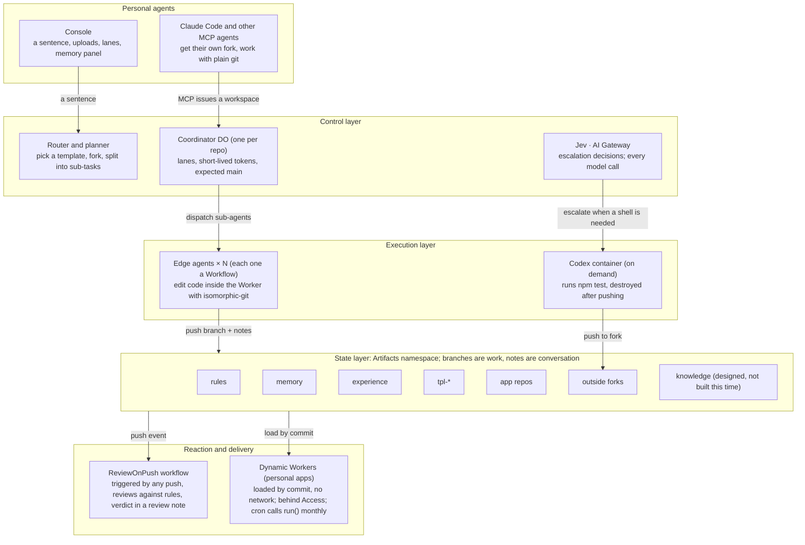

# Artifacts-OS: Engineering Change Design

> This is the design finalized after three review rounds on 2026-10-03; the code implements it on the `artifacts-os/v1` branch. During implementation a few points were corrected to match platform facts, and the body has been updated accordingly:
>
> - **Workspace fork naming**: Artifacts repository names allow only letters, digits, `.`, `-` and `_`, so forks are `<app>.ws-<agent>-<id>`, not `~`.
> - **Preview URLs**: a `/` in a branch name is written as `~` in the URL, e.g. `/apps/card-watch/@attempt~fuzzy/`.
> - **Forks copy only the default branch by default** (the binding's `defaultBranchOnly` defaults to true), so whether notes are copied with a fork is measured by D1 item 5.
> - **Review fallback**: if push events are unavailable (D1 item 3 fails), set `REVIEW_MODE=direct` and the agent triggers the review itself after pushing.
> - **Playbook merges**: `playbook/*` branches the container writes to `experience` are merged automatically by the runtime once they pass review.
> - **App page isolation**: app pages are also written by agents, so they are always served under a CSP sandbox (opaque origin), without the owner's cookies or Access headers, and cannot call the API; the approval bar is the runtime's own page and embeds the app in an iframe. Pages can still navigate to outside sites; the README says so.
> - **Merges accept only the reviewed commit**: the approval bar submits a sha, review verdicts are bound to that sha, and a branch that moves must be reviewed again.
> - **Container-written playbooks**: the container gets a fork of `experience`; after it pushes, the runtime imports and reviews the work, and merges automatically only if the change touches nothing but `playbooks/*.json`.
> - **Trace notes**, the **knowledge repository** and **email import**: designed, not implemented this time; the README's Built / Designed table says so.

2026-10-03 · Samuel (Drlon Software)

## Summary

Turn codex-cloud into a **single-Worker Artifacts-OS runtime**:

- Personal apps run as Dynamic Workers, loaded straight from Artifacts by commit.
- Sub-agents are Workflow instances that read and write repositories inside the Worker with isomorphic-git.
- Outside agents work in their own forks.
- The existing Codex container starts only when Jev decides a shell is needed.

Basis, goal and principles of this design:

- **Basis**: video script v0.3, the "Final Scoring Forecast and Battle Checklist", three rounds of judge-style review (10/3), and fact-checking against the official Cloudflare docs and the competition rules.
- **Goal**: every running shot in the video is produced for real by the code in this design. Feature freeze 10/12; submission before 10/14 23:59 PDT.
- **Principle**: Git is the only hand-off protocol. Features that were not built are not demoed; they all go in the Built / Designed table.
- **First task**: run D1 items 1–5 (see "D1 verification checklist"); they decide whether the whole architecture holds.

## Finalized decisions

The three review rounds finalized 19 decisions. Two further facts were open and were confirmed on 10/4 (see "Risks and open items").

| Round | Decision | Final |
| --- | --- | --- |
| R1 | Code baseline | Evolve codex-cloud in place; new code in TypeScript; the container host's JS is frozen; the README separates "the base from before 10/1" from "what was built during the competition" |
| R1 | Hosting personal apps | Dynamic Workers: code is read from Artifacts by `repo@commit` and loaded; any branch can be previewed right after a push; runs with no network |
| R1 | Sub-agent unit of execution | Each sub-agent is one Workflow instance; each app repository gets one coordinator Durable Object |
| R1 | Merges and conflicts | Three-way merge inside the Worker with isomorphic-git, writing conflict markers on conflict; Jev decides whether to resolve at the edge or escalate to the container |
| R1 | Push events | Primarily a namespace-level Workflow event trigger; as a fallback, whoever pushes notifies the coordinator directly |
| R1 | The three strategies in segment 2 | Come from the "merchant name normalization" playbook in the experience repo, which the planner reads and assigns |
| R1 | Edge agent main model | Chosen for "most reliable at editing code": structured JSON patch output, low temperature; decided after a small test on D1 with the same statement |
| R1 | Proof of scale | Keep as is: report only small, real numbers; no load-test layer |
| R1 | Console stack | Preact + htm, loaded as ES modules, no bundling |
| R2 | App runtime contract | No bundling, no npm dependencies; declared in `app.json`; apps have no network and read/write only through the "repo capability" the runtime passes in |
| R2 | Losing branches | Moved under `archive/` and kept, with a "lost" outcome note |
| R2 | Switching versions in the approval bar | Switch in place on the same page, no side-by-side |
| R2 | Protecting main | Internal edge agents branch in the same repository; outside agents (Claude Code, the container) use their own forks; the main guard is the backstop |
| R2 | Why bank-watch escalates | The repository declares "`npm test` must pass before merge", and the runtime does not run arbitrary shell inside the Worker, so it escalates; PDFs are converted to text with `toMarkdown` on upload; the simulated data is designed so that "the template fix makes one test fail" |
| R2 | Memory writes | Written straight to main without approval; the Console memory panel can undo in one click (git revert) |
| R3 | Preview URLs | Path form only, `/apps/<repo>/@<branch>/` (a `/` in the branch name becomes `~`), protected by Access |
| R3 | Deployment shape | Merged into one Worker; the README has a one-click deploy button and `npm run setup`; if the button doesn't work, fall back to the setup command |
| R3 | MCP | Only three tools: `request_app`, `open_workspace`, `status`; the actual work goes through plain git; authenticated with an Access service token |
| R3 | D1 checklist | 12 items in total: 1–5 must report first, 6–9 done the same day if possible, 10–12 afterwards |

## Current state

The repository is still codex-cloud: about 1,660 lines of plain JS, two Workers, 3 commits, and it **never calls Artifacts and never pushes**. About 90% of what the script needs has to be written from scratch.

| Existing part | Files | Handling |
| --- | --- | --- |
| Container host: a Durable Object driving the Codex app-server, with FIFO messaging, frame log, heartbeat | `units/host/src/index.js`, `boot.js` | Keep, with only two changes (see "Container unit and Console") |
| Metering and admission: container seconds, concurrency, daily runs | `units/host/src/user-index.js` | Keep and extend: add the app registry, the schedule table, agent run counts |
| Access JWT verification | `units/edge/src/access.js` | Switch to `ctx.access.getIdentity()`, keeping the original file as a fallback |
| AI Gateway egress | `units/host/src/index.js` | Extract into a shared module for the edge agents to use too |
| Single-page UI (task list, frame rendering) | `units/edge/src/ui.js` | Replaced by the Console; the frame rendering is reused for the container lane |
| Two wrangler configs | `units/*/wrangler.jsonc` | Merged into one `wrangler.jsonc` at the root |

**Known defects to fix along the way**:

- `scene.pushed` is never assigned.
- The GitHub branch the UI links to never existed.
- The `Dockerfile` and `docs/adr/` mentioned in the README are not in the repository.
- `.gitignore` ignores `docs/*`, so the design document has to live elsewhere, or the rule has to change.

## Target architecture

The whole runtime is one Worker. All state lives in Artifacts; the Worker only routes, coordinates and decides; a container exists only when Jev decides a shell is needed.



How to read it: top to bottom is the full path of one request.

- The only output of every executor (edge agents, the container, outside agents) is a push to the state layer.
- Push events trigger review.
- Any branch can be loaded immediately by a Dynamic Worker as a preview.

The concrete bindings are in "Deployment and README".

## Directory layout

After the change, the repository root is one Worker. The runtime writes the contents of `seeds/` and `templates/` into Artifacts itself on first run; no separate repo-creation script is needed.

```
artifacts-os/
├─ wrangler.jsonc            # the only Worker config: every binding, the cron, the event trigger
├─ package.json              # name: artifacts-os; deploy / setup / mirror scripts
├─ LICENSE  README.md  AGENTS.md
├─ src/
│  ├─ index.ts               # fetch routes: /  /api/*  /apps/*  /mcp; scheduled; exports every class
│  ├─ control/
│  │  ├─ router.ts           # a sentence → pick a template (Jev choice) → fork
│  │  ├─ planner.ts          # reads the template's AGENTS.md, app.json, memory, playbooks → sub-tasks
│  │  ├─ coordinator.ts      # RepoCoordinator DO: lanes, tokens, expected main, WebSocket
│  │  ├─ registry.ts         # UserIndex extensions: app registry, schedule table, metering
│  │  └─ jev.ts              # typesafe/jev calls and decision notes
│  ├─ agents/
│  │  ├─ agent-run.ts        # AgentRun workflow: every step of one sub-agent
│  │  ├─ review-on-push.ts   # ReviewOnPush workflow: push event → rules review
│  │  ├─ new-app.ts          # NewApp workflow: the main app-generation path
│  │  ├─ fan-out.ts          # FanOut workflow: template upgrade fan-out
│  │  └─ llm.ts              # AI Gateway main model + Workers AI fallback, JSON patch output
│  ├─ git/
│  │  ├─ memfs.ts            # in-memory file system for isomorphic-git
│  │  ├─ ops.ts              # shallow clone, commit, push, merge, archive
│  │  └─ notes.ts            # read/write notes refs by kind/writer
│  ├─ apps/
│  │  ├─ host.ts             # Dynamic Worker loading, approval bar injection, read-only preview mode
│  │  ├─ capability.ts       # the "repo capability" RPC interface passed to apps
│  │  └─ approval-bar.ts     # approval bar HTML and merge API
│  ├─ rules/check.ts         # reads the rules repo's rules and runs static checks
│  ├─ mcp/server.ts          # the three MCP tools
│  └─ container/             # units/host moved in as is, changed in two places only
│     ├─ task-host.js  boot.js
├─ console/                  # Preact + htm static assets
├─ templates/tpl-scheduled-scan/   # template source, written into Artifacts on first run
├─ seeds/{rules,memory,experience}/ # initial contents of the three knowledge repos
├─ fixtures/statements/      # simulated statements (delivered by the video lead before 10/6)
└─ scripts/{setup,mirror}.mjs # configuration bootstrap; mirrors card-watch with its notes to GitHub
```

## Repository topology and permissions

All repositories live in the same Artifacts namespace. Tokens are issued per repository, with no branch-level permissions, so "who can write where" is enforced in three layers: token scope, fork boundaries, and the main guard.

| Repository | Contents | Internal edge agents | Outside agents (Claude Code, container) | Runtime | You |
| --- | --- | --- | --- | --- | --- |
| `rules` | `rules.json`: no data leaves, card numbers keep only the last four digits, editable paths, model budget | read-only | read-only | read-only | edit directly with git |
| `memory` | card last-four digits, issuers, merchant aliases, preferences | read-only | read-only | writes main | undo in the Console |
| `experience` | playbooks, prompt strategies | read-only; new playbooks go on a branch | read-only; the container writes a branch | merges after review | undo in the Console |
| `tpl-scheduled-scan` | the template, tagged by version | fixes go on `fix/*` branches | read-only | merges and tags after approval | merge in the approval bar |
| `card-watch` and other app repos | app code, statements, snapshots | write this repo's `agent/*` `attempt/*` `upgrade/*` branches | read-only | writes main, archive | merge in the approval bar |
| `<app>.ws-<agent>-<id>` | an outside agent's workspace fork | — | write (1 hour) | fetches branches and notes | — |

**Token rules**:

- Always short-lived: 15 minutes for edge agents, 1 hour for outside agents.
- Issued and recorded by the coordinator.
- Revoked with `revokeToken` as soon as the task ends.

**Main guard**: the coordinator records "the commit main should point to". Whenever the review workflow finds main moved elsewhere, it moves it back automatically and writes a `refs/notes/outcome/guard` record.

## App runtime contract

An app is a set of ES modules in a repository, plus an `app.json`. The runtime loads it by commit as a Dynamic Worker with no network. All of the app's reads and writes go through the `REPO` interface the runtime passes in.

**`app.json` example** (card-watch):

```json
{
  "name": "card-watch",
  "template": { "repo": "tpl-scheduled-scan", "version": "v1.0" },
  "schedule": "0 9 1 * *",
  "main": "src/main.js",
  "templatePaths": ["src/runtime/**", "src/csv.js", "src/pipeline.js", "src/report-shell.js", "tests/harness.js"],
  "agentPaths": ["src/adapters/**", "src/normalize.js", "src/detect.js", "src/report.js", "tests/*.test.js", "config.json"],
  "gates": { "beforeMerge": [] }
}
```

bank-watch's `gates.beforeMerge` is `["npm test"]`, one of the reasons Jev decides to escalate to the container.

**Module contract**:

- `src/main.js` default-exports a `WorkerEntrypoint`-style object with two methods:
  - `fetch(request)`: the report page and the upload page.
  - `run({ now, mode })`: the pipeline: import, parse, analyze, report.
- The Dynamic Workers docs don't say `scheduled` can be triggered, so the monthly run is the runtime's cron calling `run()`.
- The shared transaction data structure is defined in the template's `src/types.js`, and every adapter outputs it. This is the boundary that lets the two sub-agents in segment 0 work in parallel.
- Links in pages are always relative, because preview URLs carry a `/@<branch>/` prefix.

**The `REPO` capability interface**: the runtime creates an RPC stub with `ctx.exports` and passes it in `env`.

| Method | Purpose | In preview mode |
| --- | --- | --- |
| `readFile(path)` / `list(dir)` | read the currently loaded commit | available |
| `memory(key)` | read-only access to one file in the memory repo, e.g. `merchant-aliases.json` | available |
| `writeSnapshot(name, json)` | write to `snapshots/`, committed by the runtime | kept in memory only, not committed |
| `log(event)` | send an event to a Console lane | available |

**Load parameters**:

- Call `LOADER.get("<repo>@<commit>", …)`.
- `globalOutbound: null`, i.e. no network.
- `limits: { cpuMs }`, against infinite loops.
- Module files are read with Artifacts' `readTree` / `readBlob` and cached by commit in the coordinator.

**The template's `AGENTS.md`** spells out three things:

1. No npm dependencies may be added.
2. Only paths in `agentPaths` may be changed.
3. The data structure and relative-path conventions.

## git-notes conventions

Following the design in script v0.3:

- A commit carries only a one-line title and a one-sentence description.
- Everything agents say to each other is written as notes.
- Each notes ref has exactly one writer and a two-level kind/writer name, so concurrent notes pushes never reject each other.

| Notes ref | Writer | Contents | Built |
| --- | --- | --- | --- |
| `refs/notes/intent/<agent-id>` | each sub-agent; outside agents use `claude-code` and `codex-container` | claims, intent, milestone status; the `to` field defaults to `all` | 10/5 |
| `refs/notes/telemetry/<agent-id>` | each sub-agent | model, tokens, duration | 10/5 |
| `refs/notes/review/<auditor-id>` | the review workflow | verdict against rules and the rules hit | 10/7 |
| `refs/notes/decision/jev` | Jev | resolve at the edge or escalate, with probabilities; when addressed to the container, `to` is the container id | 10/10 |
| `refs/notes/decision/owner` | the runtime, on your behalf | the approval bar choice and reason | 10/8 |
| `refs/notes/outcome/<source>` | owner, rules, tests, guard | merged or lost, blocked or not, test results | 10/8, can be cut |
| `refs/notes/trace/<agent-id>` | each agent | prompts, tool calls, outputs; truncated to a summary plus hash when over budget | 10/9, can be cut |

**Implementation notes**:

- isomorphic-git's `addNote` / `readNote` / `listNotes` all accept custom refs. When pushing, put the branch and your own notes ref in the same push.
- An outside agent's notes are written in its own fork. When the runtime merges the branch, it also fetches `refs/notes/*` into the original repository.
- Notes written by the review workflow also produce pushes. If notes pushes trigger events (D1 item 3), the workflow filters out `refs/notes/*` by ref to avoid a trigger loop.
- The judges' verification commands (same in the README and segment 5): first `git fetch origin 'refs/notes/*:refs/notes/*'`, then `git log --notes='refs/notes/*'`.

## Core flows

Eight flows (A–H) map to the script's segments. Each uses one hand-off only: pushing branches and notes to Artifacts.

### A. Generate an app from one sentence (segment 0)

1. The Console calls `POST /api/needs`, starting the NewApp workflow; the timer starts.
2. Routing: Jev uses `choice` to pick `tpl-scheduled-scan` from the template list; the probabilities show in the lane.
3. Fork the template as `card-watch`, poll `info()` until ready, and record the fork time.
4. The planner reads the template's `AGENTS.md`, `app.json` and memory (card last-four digits, issuers) and splits the work into two sub-tasks along the transaction data structure.
5. Start two AgentRuns:
   - `agent/input`: format adapters + merchant name normalization.
   - `agent/analysis`: subscription detection + price-increase detection + report.
6. Once both branches pass the rules review, they merge into main automatically. First generation skips the approval bar; the approval bar is only for "changes".
7. The app is registered in the app table and `/apps/card-watch/` becomes available. Upload the August–October statements, click "Run now", the report appears, the timer stops: that is T1.

### B. The steps of one sub-agent (AgentRun workflow)

1. Request a token from the coordinator: this repository writable for 15 minutes; rules, memory and experience read-only.
2. Shallow-clone into memory and fetch `refs/notes/intent/*`.
3. Read existing intent notes, claim a direction nobody holds, write `intent` (claimed), and push the notes first.
4. Call the main model, which outputs a JSON file patch. The patch may touch only paths in `agentPaths`.
5. Smoke check: load the commit in a Dynamic Worker in preview mode and call `run()` once; on an exception, retry once.
6. Commit (one-line title), write `telemetry` and `intent` (pushed), and push the branch together with the notes.
7. Report to the coordinator: update the lane status and add 1 to the meter.

### C. Three competing branches and two layers of review (segment 2, load-bearing)

1. You describe the Streamly problem in the Console; the planner reads the "merchant name normalization" playbook from experience and gets three strategies.
2. Three AgentRuns start about 2 seconds apart on `attempt/rules`, `attempt/fuzzy` and `attempt/enrich`. Later ones read the intent notes of earlier ones.
3. Each push triggers ReviewOnPush. It runs three static checks against `rules.json` and writes a `review` note:
   - any outbound network call;
   - only allowed paths changed;
   - the card-masking test cases satisfied.

   `attempt/enrich` is rejected for calling an outside service; even if the check missed it, the no-network sandbox would make it fail at run time.
4. The other two branches are each previewable and wait for you in the approval bar.

### D. Approval bar and merge (segments 2 and 3)

1. When you open `/apps/card-watch/@attempt~fuzzy/`, the runtime injects the approval bar at the top of the page. It contains:
   - what changed: the file list + a summary of the intent note;
   - what the rules say: the review note;
   - why: intent / decision;
   - switching versions in place;
   - a Merge button.
2. The preview runs read-only and produces a report live from the same statement, without writing snapshots.
3. After you click Merge:
   - the runtime merges with a write token and pushes main, updating the "expected main" in the coordinator;
   - it writes `decision/owner`;
   - the other branches move under `archive/`, each with a "lost" `outcome` note.
4. The live URL points at the new commit and the Dynamic Worker loads the new code automatically.

### E. Memory writes and undo (segment 2)

1. After the merge, the runtime has the model extract merchant aliases from the change and commits them straight to the memory repo's `merchant-aliases.json`.
2. The Console memory panel lists recent memory commits, each with an "Undo" button that creates a revert commit.
3. Undo once during real use in the days before recording, so a revert shows up in the history naturally.

### F. Template fix fan-out and container escalation (segment 3)

1. `"ACME, INC."` in the November statement breaks the template's CSV reader. The agent fixes it in card-watch, notices the change falls in `templatePaths`, writes a note marking it "template code", and pushes the fix to the template repository as the branch `fix/csv-quoted-comma`.
2. You click merge in the template's approval bar; the runtime tags `v1.1` and starts the FanOut workflow.
3. FanOut starts one merge agent per sibling repository from the coordinator; each fetches template `v1.1` and runs `merge(abortOnConflict: false)`:
   - `card2-watch`: clean merge, producing an `upgrade/tpl-v1.1` branch whose preview waits for your confirmation (green).
   - `phone-watch`: its semicolon customization and the fix touch the same function, producing a conflict. Jev uses `choice` and judges it resolvable at the edge; an edge agent fixes the conflict markers with the model and pushes (amber).
   - `bank-watch`: `gates.beforeMerge` requires `npm test`. Jev judges that a shell is needed and writes `decision/jev` (with `to` set to the container) (red).
4. The container escalation steps:
   1. Fork `bank-watch.ws-codex-container-<id>` and issue a 1-hour write token.
   2. Start the container. Codex reads Jev's note, checks out the given commit, runs `npm test` and sees it fail, fixes it, runs it green, and pushes to the fork.
   3. Codex also writes the solution up as a playbook and pushes it to a branch of experience.
   4. The container is destroyed and the meter records the container minutes.
5. The runtime fetches the branch and notes from the fork, builds a bank-watch preview, and waits for your confirmation.

### G. Outside agents via MCP (segment 4)

1. Claude Code calls `open_workspace("card-watch", "add Northwind Bank format")` and gets the fork URL, a write token, a read-only token and AGENTS.md.
2. Claude Code clones, edits and commits with plain git, writes `refs/notes/intent/claude-code`, then pushes to its own fork.
3. The namespace-level push event triggers ReviewOnPush. The runtime recognizes the fork and pulls the branch into the original repository as `ext/claude-code/<branch>`. A new lane appears in the Console, and the preview has the same approval bar.

### H. Statement upload and the monthly run (segments 0 and 6)

1. Upload statements in the Console: CSV is committed straight to `data/statements/`; PDF is first converted to text with `toMarkdown`, and the original and the text are committed together.
2. The runtime's cron checks the app table hourly and calls `run()` on the main commit of each app that is due; the runtime commits the resulting snapshot to `snapshots/`.
3. The Console shows the next run time; "Run now" takes the same path.

## Container unit and Console

### Container unit: two changes only

The container host's (TaskHost's) heartbeat, FIFO messaging, frame log and metering are all kept as is. Moving it into the single Worker only means importing it from a different entry file.

1. **Take over from a given Artifacts commit**:
   - `boot.js` clones from the environment variable `ARTIFACTS_GIT_REMOTE` (`https://x:<token>@<remote>`), then runs `git checkout <sha>`.
   - At boot it also runs `apk add nodejs npm`, to run `npm test`.
2. **Push back to Artifacts**:
   - After the "local commit" in the stop sequence, add a `git push` step that pushes the branch and `refs/notes/*` to the fork.
   - After a successful push, assign `scene.pushed` and notify the coordinator.

Two more small changes:

- The commit author becomes `codex-container`.
- Codex's goal text is generated by the runtime and always contains four steps: read the `decision/jev` note, run the tests, fix, write a playbook.

### Console: Preact + htm, no bundling

| View | Contents | Script |
| --- | --- | --- |
| Input and app list | a one-sentence input box; one card per app showing template version, next run time, live URL | segments 0, 6 |
| Lanes | one lane per agent, with statuses claimed → started → pushed → blocked → done; Jev's card shows the choice and probabilities; the container lane has a container-minute counter; a real timer in the top right | segments 0, 2, 3, 4 |
| Meter bar | agent runs, containers, container minutes | segments 3, 6 |
| Upload and run | upload statements, run now, report link | segments 0, 3 |
| Memory panel | recent memory commits, diffs, undo buttons | segment 2 |
| Event log export | `/api/events.ndjson`, timestamped, for aligning the architecture mini-map in post | segments 0–5 |

The approval bar is not in the Console; it is injected at the top of the app page. This is the core shot of "reviewing changes inside the app". Live data comes from the coordinator's WebSocket and does not go into Git.

## Deployment and README

The goal is one Worker, one button, one setup command. Whether the button covers every binding is measured by D1 item 10; if it doesn't work, the README documents only the setup command, truthfully.

**Bindings `wrangler.jsonc` needs**:

- `artifacts`: `ARTIFACTS`, namespace `artifacts-os` (created automatically when the first repo is made)
- `worker_loaders`: `LOADER`
- `ai`: `AI` (for Jev, `toMarkdown`, the fallback model)
- `durable_objects`: `RepoCoordinator`, `UserIndex`, `TaskHost` (the container class)
- `workflows`: `AgentRun`, `ReviewOnPush`, `NewApp`, `FanOut`
- `containers`: `TaskHost`, image alpine 3.20, no Dockerfile to build
- `triggers.crons`: hourly
- `triggers.events`: `cf.artifacts.repo.pushed`, filtered by namespace only, targeting `ReviewOnPush`
- `assets`: `console/`
- secrets: the AI Gateway token, the main model key, `OPENAI_API_KEY` (for Codex in the container)

**What `npm run setup` does**:

1. Checks the Wrangler version (≥ 4.145).
2. Prompts for the secrets.
3. Deploys.
4. Opens the Worker settings page and prompts to enable one-click Access.
5. Creates the Access service token for MCP and prints the Claude Code config snippet.

The seed repositories are created by the runtime on the first request, not in setup.

**The README must include**:

- The one-click deploy button and the setup command; the Console main path; the optional MCP path.
- A two-column Built / Designed table matching the segment 5 title cards.
- The notes verification commands; the public mirror URL.
- One line saying which code is the codex-cloud base from before 10/1 and which was built during the competition.
- The MIT license and the authors (Doris Gan and teammate).

**Public mirror**: `npm run mirror card-watch` fetches from Artifacts with real git (read-only token) and pushes, together with `refs/notes/*`, to `artifacts-os-demo-card-watch` on GitHub.

**Domain**:

- Recording and the public demo use the custom domain `artifacts-os.nevoflux.app`.
- URLs are still path-form, e.g. `artifacts-os.nevoflux.app/apps/card-watch/`, `…/apps/card-watch/@attempt~fuzzy/`.
- Access has a self-hosted application on that domain covering `/apps/*`, `/api/*`, `/mcp` and the Console.
- Judges deploying themselves have no domain and simply use workers.dev with one-click Access. The code is identical on both paths.

## D1 verification checklist

12 items, ordered by how badly a failure would overturn the design. 1–5 must report first, 6–9 done the same day if possible, 10–12 afterwards. If any item fails, switch to the alternative that same day and update the narration to match.

- [ ] **1** isomorphic-git in a Worker can shallow-clone, commit and push a template-sized repository within memory; also record fork-to-ready time (measured 10 times). Fail → move edge patching into the container (a major downgrade).
- [ ] **2** A Dynamic Worker can read code from Artifacts by commit and load it; `globalOutbound: null` cuts the network; the `REPO` capability can be passed in over RPC; `run()` can be called. Fail → fall back to Workers for Platforms + a deploy workflow.
- [ ] **3** The namespace-level `cf.artifacts.repo.pushed` Workflow trigger: pushes to newly forked repositories also trigger it; whether notes pushes trigger it. Fail → whoever pushes notifies the coordinator directly.
- [ ] **4** isomorphic-git's `merge(abortOnConflict: false)` writes conflict markers inside a Worker, and after they are resolved can commit with two parents. Fail → every conflict escalates to the container.
- [ ] **5** Notes: custom refs can be read, written and pushed; whether forks carry notes; whether `refs/notes/*` can be fetched from a fork. Fail → use commit trailers, with the downgrade narration line.
- [ ] **6** The "writable fork + read-only original" token combination works. Fail → fall back to same-repo branches + the main guard.
- [ ] **7** `typesafe/jev`'s `choice` returns probabilities. Fail → use a small Workers AI model + JSON schema.
- [ ] **8** The container pushes with the fork's write token, and the branch survives the container's destruction. Fail → keep results in the coordinator first, then have the Worker push.
- [ ] **9** One-click Access protects `/apps/*` on workers.dev and rejects unauthenticated requests; the Access application on the custom domain artifacts-os.nevoflux.app works the same. Fail → use short-lived signed links.
- [ ] **10** The video lead goes through the one-click deploy button with a brand-new account. Fail → keep only the setup command.
- [ ] **11** `toMarkdown` converts the simulated PDF statement into parseable table text. Fail → bank-watch uses CSV instead.
- [ ] **12** Main model test: the same statement and the same request run 3 times give consistent results. Fail → switch models or lower the temperature.

Two items were removed from the old checklist:

- Enabling Workers for Platforms (replaced by Dynamic Workers).
- Reading commit trailers (now the fallback for item 5).

## Schedule

Engineering freezes features on 10/12, ordered by how load-bearing each part is: main path 10/6, all of segment 2 by 10/9, fan-out and container 10/11, MCP and mirror 10/12.

| Date | Engineering (1 person) | Video (1 person) | Recordable |
| --- | --- | --- | --- |
| 10/3 | D1 items 1–5; single-Worker skeleton, merge the two wrangler configs | rewrite narration per this design; start designing the simulated data | — |
| 10/4 | D1 items 6–12; template `tpl-scheduled-scan` and the `app.json` contract; seed repositories | segment 1 three-act animation; first architecture diagram (with this design's components) | segment 1 |
| 10/5 | AgentRun workflow, coordinator, split between the two sub-agents; Dynamic Workers serving `/apps/` | first version of the simulated statements | — |
| 10/6 | upload and run now; minimal Console (lanes); main path end to end, measure T1 | set the cold-open narration by T1 tier; deliver all simulated data (including the conflict and test-failure designs); README skeleton | segment 0 |
| 10/7 | ReviewOnPush, rules checks, review notes; playbook-driven three-branch competition | segment 0 footage; segment 5 architecture animation | — |
| 10/8 | approval bar injection, in-place switching, merge, archive, decision and outcome notes | segment 2 first-half footage | — |
| 10/9 | memory write-back and undo; `git log --notes` demo; segment 2 locked | from-scratch deploy check with a new account; all of segment 2 | segment 2 |
| 10/10 | three sibling repositories; pushing the template fix upstream; FanOut and merges; Jev triage | segment 3 template-fix diff | — |
| 10/11 | container escalation (fork token, `npm test`, push, playbook); metering | all of segment 3 | segment 3 |
| 10/12 | the three MCP tools; public mirror; idle cost calculation; final README; **feature freeze** | segments 4 and 6; line-by-line check against Built / Designed | segments 4, 6 |
| 10/13 | bug fixes only | record narration, edit; segment 5 clone shot | segment 5 |
| 10/14 | on standby | final check and submission (before 23:59 PDT) | — |

## Script and narration changes

Fact-checking and the three rounds of decisions show 7 places in script v0.3 that must change, or the video will not match the code.

| Segment | Original line or shot | Change to | Why |
| --- | --- | --- | --- |
| 3 | Workers can't run them, so Jev escalates. | Its tests are a shell job: `npm test`, in Node. So Jev escalates. | the tests could actually run in a Dynamic Worker; the escalation reason has to be true |
| 3 | …and pushes a branch back to Artifacts. | …and pushes to its own fork in Artifacts. | outside agents use forks |
| 4 | It reads the same memory and rules… | prefix with: It gets its own fork, and from there it's plain Git. | MCP only hands out keys; the actual work is git |
| 5 layer 2 | …mints their tokens: write access to the repo they're working on… | …mints short-lived tokens: agents I run get a branch, outside agents get their own fork, and everyone gets read-only rules. | the permission model changed |
| 5 layer 5 | Push events flow through a queue into a review workflow, Workers Builds turns branches into previews, and Workers for Platforms serves each repo's app… | Every push, from any agent, starts a review workflow. Every branch is live the moment it's pushed: the runtime loads it as a Dynamic Worker with no network, behind Cloudflare Access. | switched to Workflow triggers and Dynamic Workers |
| 5 architecture diagram | Queue, Workers Builds, Workers for Platforms | replace with Workflow triggers and Dynamic Workers; add `info`, `revokeToken` and Dynamic Workers to the primitives list | the components changed |
| 6 | idle cost [C] | compute the marginal cost of one app from official unit prices, noting "excludes the Workers Paid base fee; uses the unit prices after the free allowance is used up" | a single app mostly fits in the free allowance, so the basis must be stated |

**Update to the downgrade narration table**: the old row "#4 Workers for Platforms can't be enabled" becomes "#2 Dynamic Workers unavailable": fall back to Workers for Platforms and use the original layer 5 narration.

## Cut order

If behind schedule, cut in the order below. The following cannot be cut and are not on the list:

- segment 2;
- the main app-generation path;
- approval bar merges;
- template fan-out;
- container escalation (must really happen at least once);
- MCP;
- metering;
- the public mirror.

Cut order:

1. Container-written playbooks and edge agents reading playbooks (drop the whole "Before it goes…" sentence in segment 3)
2. Trace notes and outcome notes (drop the half-sentence "along with every run's trajectory" in segment 5)
3. Showing memory undo (drop the half-sentence "and a history I can roll back" in segment 2)
4. Reduce segment 0's two sub-agents to one (use the downgrade line)
5. Jev picking the template becomes a plain model call (no narration impact)

## Risks and open items

The biggest single points of risk are D1 items 1 and 2. If isomorphic-git can't run in Worker memory, or Dynamic Workers can't load by commit, the architecture has to fall back to the heavy design.

**Confirmed facts (10/4)**:

- [x] The LICENSE copyright holder "Doris Gan" is a team member: keep it unchanged; the README author line names both people.
- [x] The domain `nevoflux.app` is already hosted, and the `doc` and `portal` subdomains are taken: the runtime binds `artifacts-os.nevoflux.app`.

**Risks**:

| Risk | Impact | Response |
| --- | --- | --- |
| Dynamic Workers are still in public beta | the app hosting design fails | D1 item 2; fall back to Workers for Platforms |
| Worker memory limits | clones and merges fail | keep the template very small; shallow clones only; no large files in app repos |
| Unstable model output | results differ from the script during recording | structured output, low temperature, strategies from playbooks; D1 item 12 |
| Notes behavior with forks and events is undocumented | affects the notes shots in segments 2 and 4 | D1 items 3 and 5; trailer fallback, downgrade narration line |
| At most 4 Dynamic Workers handle requests concurrently within one request | concurrent smoke checks during fan-out | run fan-out smoke checks in the coordinator (limit 10), or serially |
| Two sources disagree on when Artifacts billing starts (docs 10/14, blog 10/15) | post-competition bills | prepare for billing from 10/14; clean up demo repositories after the competition |
| Eligibility of both members | prize eligibility | both must be 18 or older and legal residents of the US or Canada |

## Sources

- [Competition blog post](https://blog.cloudflare.com/next-git-platform-on-cloudflare/)
- [Competition terms](https://www.cloudflare.com/documents/build-next-gen-git-platform-competition-terms.pdf)
- [Artifacts Workers binding](https://developers.cloudflare.com/artifacts/api/workers-binding/)
- [Event subscriptions](https://developers.cloudflare.com/artifacts/guides/event-subscriptions/)
- [Build and deploy on push](https://developers.cloudflare.com/artifacts/guides/build-and-deploy-on-push/)
- [isomorphic-git example](https://developers.cloudflare.com/artifacts/examples/isomorphic-git/)
- [Artifacts limits](https://developers.cloudflare.com/artifacts/platform/limits/)
- [Artifacts pricing](https://developers.cloudflare.com/artifacts/platform/pricing/)
- [Dynamic Workers API](https://developers.cloudflare.com/dynamic-workers/api-reference/)
- [Dynamic Workers pricing](https://developers.cloudflare.com/dynamic-workers/pricing/)
- [One-click Access for Workers](https://developers.cloudflare.com/changelog/post/2025-10-03-one-click-access-for-workers/)
- [Deploy buttons](https://developers.cloudflare.com/workers/platform/deploy-buttons/)
- [typesafe/jev](https://developers.cloudflare.com/ai/models/typesafe/jev/)
- [toMarkdown](https://developers.cloudflare.com/workers-ai/features/markdown-conversion/)
- [isomorphic-git merge](https://isomorphic-git.org/docs/en/merge)
